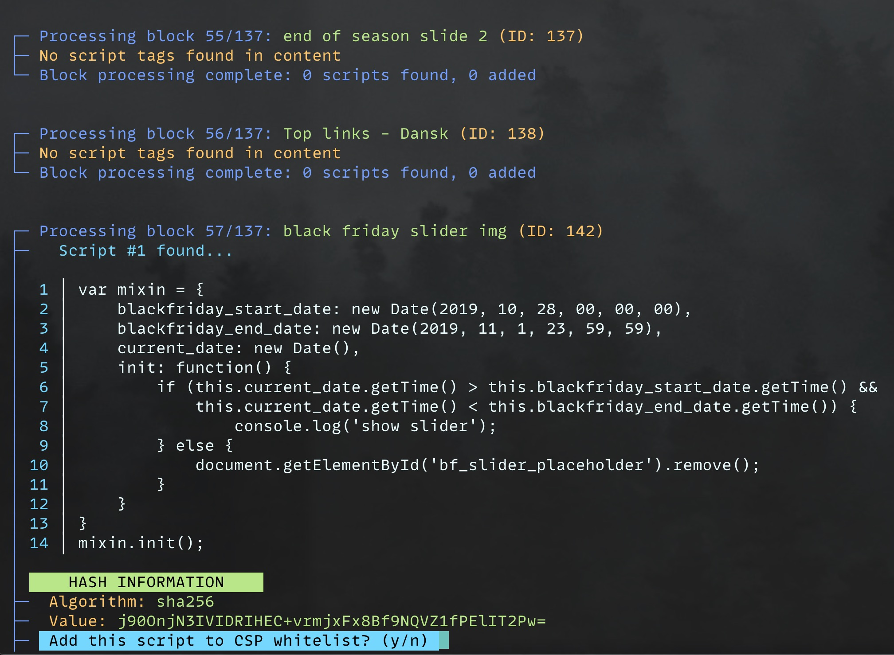
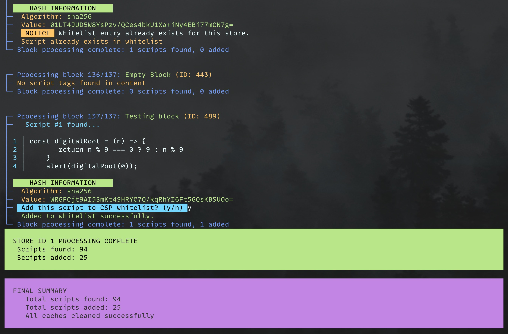

# Advanced Content Security Policy (CSP) module for Magento 2

## Overview

The `Hryvinskyi_Csp` module is a Magento 2 extension that provides additional Content Security Policy (CSP) configurations.
This module allows administrators to manage CSP whitelists from the Magento admin panel 

## Features
 1. **CSP Whitelist Management**: Administrators can manage CSP whitelists directly from the Magento admin panel.
 2. **Store-Specific Configuration**: Module provides store view specific CSP configuration.
 3. **Violation Reports**: The module collects and displays CSP violation reports, helping administrators identify and address security issues.
 4. **One-Click Conversion**: Possibility to convert violation reports to whitelist rule with one click.
 5. **Automatic URL Collection**: Automatically collects and adds all storefront URLs to the CSP whitelist.
 6. **CSP Header Splitting**: Automatically splits large CSP headers into multiple smaller ones to prevent issues with header size limits.
 7. **Flexible Configuration**: The module provides various configuration options to enable or disable specific CSP features.
 8. **Admin Panel Integration**: The module integrates with the Magento admin panel, providing a user-friendly interface for managing CSP settings.
 9. **Import/Export**: Support for importing and exporting whitelist rules.
10. **Automatic Script Hash Generation**: Command-line tool to scan CMS pages/blocks and configs for inline scripts and generate CSP hashes
11. **Visual Hash Validation**: See at a glance if your script hashes are valid

## Requirements

- Magento 2.4.4 or higher
- PHP 8.1 or higher

## Installation

### Composer (recommended)

```bash
composer require hryvinskyi/magento2-csp
bin/magento module:enable Hryvinskyi_Csp
bin/magento setup:upgrade
bin/magento setup:di:compile
bin/magento setup:static-content:deploy
```

### Manual Installation

1. Download the module and upload it to `app/code/Hryvinskyi/Csp`
2. Enable the module and update the database:

```bash
bin/magento module:enable Hryvinskyi_Csp
bin/magento setup:upgrade
bin/magento setup:di:compile
bin/magento setup:static-content:deploy
```

## Usage

**Admin Panel Navigation**

The module adds a new menu item in the admin panel:

 1. **Content Security Policy**: Main menu item providing access to CSP features
   - **Whitelist**: Manage CSP whitelist rules
   - **Violation Report**: View and manage CSP violation reports
   - **Configuration**: Configure CSP settings

### Managing Whitelist Rules

 1. Navigate to **System** > **Content Security Policy** > **Whitelist**
 2. Click **Add** to create a whitelist entry manually
 3. Fill in required fields:
    - **Identifier**: Unique name for the rule 
    - **Policy**: CSP directive (e.g., script-src, style-src)
    - **Value Type**: Type of value (URL, Domain, etc.)
    - **Value**: The actual value to whitelist 
    - **Store Views**: Select applicable store views 
    - **Status**: Enable or disable the rule

### Generating Script Hashes

To make inline scripts work with CSP, you must generate cryptographic SHA hashes and add them to your whitelist. 
The module provides a console tool that lets you review each script and approve the addition of its hash to your CSP configuration.
Use the built-in CLI tool:

```bash
bin/magento hryvinskyi:csp:generate-script-hashes --type=page --type=block --store=1
```

Options:
 - `--type`: Specify which entity types to scan (page, block, config)
 - `--store`: Specify store ID (default is all stores)

### Screenshots



### Configuration
Navigate to **System** > **Content Security Policy** > **Configuration** or **Stores** > **Configuration** > **Security** > **Content Security Policy** to access module settings.

### CSP Header Splitting

CSP headers can grow large, especially when many domains are whitelisted. Some servers and proxies have limits on header sizes, which can cause issues with security policy enforcement.

This module includes CSP header splitting functionality that automatically splits large CSP headers into multiple smaller headers to ensure proper delivery.

To configure header splitting:

1. Go to **Stores** > **Configuration** > **Security** > **Content Security Policy**
2. In the **General** section, you'll find:
    - **Enable CSP header splitting**: Toggle to enable/disable the feature
    - **Max CSP header size (bytes)**: Specify the maximum size for a single header before splitting occurs (default: 4096 bytes)

When enabled, the module will monitor CSP header sizes and automatically split them if they exceed the configured maximum size.

## Support
If you encounter any issues or have questions, please contact the author or open an issue on GitHub.

## License
This module is licensed under the MIT License - see the LICENSE file for details.

## Author

Volodymyr Hryvinskyi  
Email: volodymyr@hryvinskyi.com  
GitHub: https://github.com/hryvinskyi